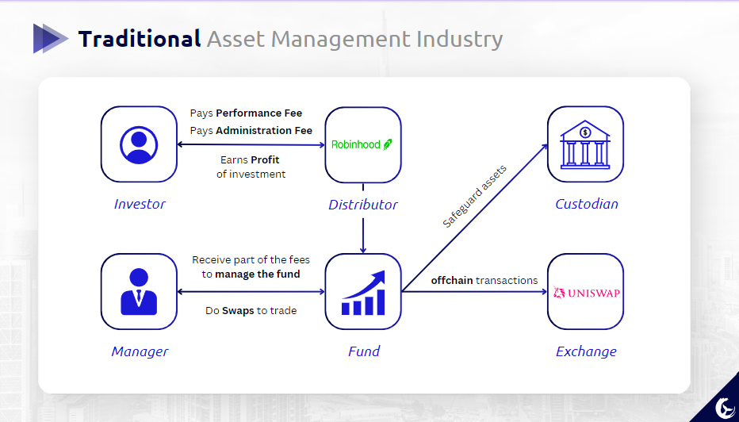
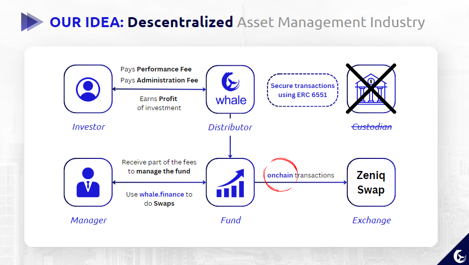

# whale.finance - ZenCon 2023

## Decentralized Asset Management

whale.finance basically implements Decentralized Asset Management with ERC 6551. We want to give the opportunity to investors sees their money been managed with full security and auditability.

## The Idea

This project uses ERC 6551 to allow managers to hold assets from investors. In this way, we can basically make a descentralized asset management using EVM. The platform is designed for the two publics: The investors, who will be able to invest their tokens in really great funds around the work in a safe way, and the managers, who will be able to manage and hold investor tokens and can have a profit to themselves.

### Traditional

These bullet points below describes the flow over a fund invesment in the traditional financial market, with 6 main stakeholders:

- **Investor & Fund:** To have a share in the fund, the investor must pay a management fee to the manager, and a performance fee equivalent to a percentage above the market benchmark. In this way, the manager aligns with the investment by earning these fees for managing the fund.

- **Distributor & Fund:** The distributor acts as a bridge between the fund and potential investors, marketing and selling the fund's financial products. Through collaborations and agreements, distributors help expand the fund's reach and increase its assets under management, enhancing the fund's visibility and accessibility.

- **Exchange & Fund:** Exchanges serve as vital platforms where funds can actively participate in trading activities, acquiring or disposing of assets as per their investment strategies. They facilitate a transparent environment where funds can execute trades based on real-time market conditions, thus helping in the price discovery process and achieving investment objectives.

- **Custodian & Fund:** Custodians play a pivotal role in safeguarding the assets of the fund, ensuring that they are held securely and are not susceptible to theft or loss. Apart from asset safekeeping, they also assist in transaction settlements and administrative services, thus ensuring smooth operational flow and compliance with regulatory requirements.

### Descentralized

Benefits to descentralize the asset management industry and differences from the traditional flow:

## User Roles

### Investors

Features:

- **Funds List:** Can choose a fund in a list of funds to make an investment _(/fundslist route)_
- **Invest:** Can see stats about the fund chosen, like a performance chart, and then invest in the favorite ones _(/funds/id route)_
- **Dashboard:** Can see stats and metrics about your investments _(/investor route)_

### Managers

Features:

- **Create a fund:** Can create a fund based on the parameters listed below in the Fund section  _(/ route)_
- **Funds List:** Can choose a fund in a list of funds to see stats about the managed fund _(/manager route)_
- **Dashboard:** Can see stats about the fund chosen and then swap tokens to operate the fund _(/manager/id route)_

### Fund

The main parameters to create a fund:

- **Name:** The official title of the fund, used for recognition and branding.
- **Ticker:** A unique series of letters representing the fund in the stock market, used for quick identification.
- **Account:** The designated account for managing the fund's financial transactions and maintaining records.
- **Tokens:** Digital assets within the fund that can represent shares or other assets, facilitating flexible transactions.
- **Administration Fee:** A charge levied to cover the fund's operational costs, maintaining its viability.
- **Performance Fee:** A fee charged based on the fund's performance, serving as an incentive for fund managers.
- **Open Investment:** The time frame during which investments can be made into the fund, helping to manage the inflow of capital.
- **Close Investment:** The period indicating when the fund stops accepting new investments, assisting in portfolio stability.
- **Maturation Time:** The projected time frame for the fund to reach its investment goals, guiding investors on expected returns.

## How it Works
- A concise overview of the technical workings of the platform.
- The role of ERC 6551 and EVM in facilitating decentralized asset management.

### Technology

- Frontend: We used typescrit + tailwind css + vite.js to deploy more fast and be adjusted to our web3 project, that does not have backend
- Contracts: We use ERC 6551 to allow managers to hold assets from investor, and control them.

### Folder Structure

Here is the folder structure of the project with comments about files:

├── README.md
│
├── frontend/
│     └── src/
│          ├── App.tsx
│          ├── assets/
│          ├── components/
│          │      ├── ConnectWallet/        
│          │      ├── DataDiv/           
│          │      ├── Footer/              
│          │      ├── FormInvestor/           
│          │      ├── FormManager/          
│          │      ├── FormSwap/              
│          │      ├── Header/                 
│          │      ├── LineChartComponent/   
│          │      └── PieChartComponent/    
│          ├── contracts/
│          │      ├── QuotaToken.ts
│          │      ├── SafeAccount.ts
│          │      └── WhaleFinance.ts
│          ├── firebase/
│          ├── pages/
│          │      ├── CreateFund/
│          │      ├── DashboardId/
│          │      ├── FundId/
│          │      ├── FundsList/
│          │      ├── Home/
│          │      ├── Investor/
│          │      ├── Layout/
│          │      ├── Manager/
│          │      ├── SuccessFund/
│          │      └── SuccessInvestment/
│          └── utils/
│                ├── addresses.ts
│                └── connectMetamask.ts
│
└── whale-finance/
      └── src/
           ├── Counter.sol
           ├── ERC6551Registry.sol
           ├── MockERC20.sol
           ├── QuotaBeacon.sol
           ├── QuotaToken.sol
           ├── SafeAccount.sol
           ├── WhaleFinance.sol
           └── interface/
                 ├── IERC6551Account.sol
                 ├── IERC6551Registry.sol
                 └── IV2SwapRouter.sol
      └── test/
            └── WhaleFinance.t.sol

And the main codes developed are:

- List of prerequisites necessary to get started with the project.

## Usage
### Prerequisites
- List of prerequisites necessary to get started with the project.

### Installation
- Step-by-step installation guide or links to relevant documentation.

### Usage
- Basic usage guidelines with examples, if possible.

